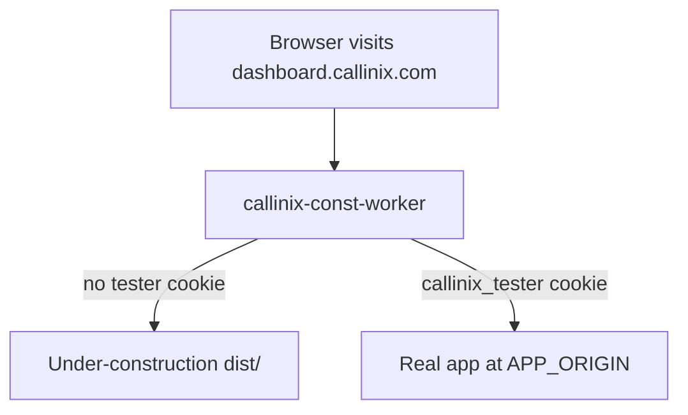

# Deploy Callinx under-construction to callinix.com

## Wrong GitHub repo?

Cloudflare project **`callinix-const-worker`** must use repo **`awunjia/callinix-const-worker`**.

The app code lives in **`awunjia/callinix-const`** unless you push it to the worker repo (this project is pushed to both).

If the worker repo only has a README, deploys will fail with *Could not detect static files*.

---

## Why the GitHub clone failed (exit code 128)

Cloudflare expects a **`main`** branch by default. This repo only had **`prod`**, so the clone failed with:

`Failed: source repo failed to clone`

### Fix (pick one)

**A. In Cloudflare dashboard (fastest)**  
Workers & Pages → your project → **Settings** → **Build** → set **Production branch** to `prod`.

**B. Add a `main` branch on GitHub** (matches Cloudflare default):

```bash
git push origin prod:main
```

Then reconnect the project or trigger a new deploy.

**Also check:** GitHub → Settings → Applications → **Cloudflare Workers & Pages** is installed and has access to `awunjia/callinix-const` (required if the repo is private).

---

## Build settings (Cloudflare Workers — Git deploy)

Your deploy command must **install dependencies and build** before Wrangler uploads assets.

| Setting | Value |
|--------|--------|
| **Deploy command** | `npm ci && npx wrangler deploy` |
| Root directory | `/` |
| Node version | `22` (required by Wrangler 4.94+) |

Do **not** use `npx wrangler deploy` alone — `dist/` will not exist and you will get:

`Could not detect a directory containing static files`

`wrangler.toml` includes `[build] command = "npm run build"`, so `wrangler deploy` runs Vite after `npm ci`.

Alternative deploy command: `npm run cf:deploy`

---

## dashboard.callinix.com — public landing vs real app

This worker sits **in front of** `dashboard.callinix.com`. Everyone hits the worker first; the worker decides what to show.

| Visitor | What they see |
|--------|----------------|
| Normal user | Under-construction React site (built into the worker) |
| You / test team (preview cookie) | Real dashboard app at `APP_ORIGIN` |



**Important:** `APP_ORIGIN` must be the **backend URL of your real app**, not `https://dashboard.callinix.com` (that would loop back into this worker).

Examples:

| Your real app is hosted on | Set `APP_ORIGIN` to |
|---------------------------|---------------------|
| Cloudflare Pages (default `*.pages.dev`) | `https://callinix-dashboard.pages.dev` |
| Another Worker / service | That service’s `.workers.dev` or internal hostname |
| VPS / Kubernetes | `https://api-internal.callinix.com` |

---

### Step 1 — Attach the custom domain to this worker

1. [Cloudflare dashboard](https://dash.cloudflare.com) → **Workers & Pages** → **callinix-const-worker**
2. **Settings** → **Domains & Routes** → **Add** → **Custom domain**
3. Enter: `dashboard.callinix.com`
4. Save (Cloudflare creates the DNS record if the zone is on Cloudflare)

Remove any **other** worker routes or Pages custom domains on `dashboard.callinix.com/*` so only this worker handles traffic.

---

### Step 2 — Point DNS (if not auto-created)

In **DNS** for `callinix.com`:

| Type | Name | Content | Proxy |
|------|------|---------|-------|
| CNAME or Worker route | `dashboard` | (attached by Workers UI) | Proxied (orange cloud) |

---

### Step 3 — Set environment variables

**Workers & Pages** → **callinix-const-worker** → **Settings** → **Variables and Secrets**

| Name | Type | Example |
|------|------|---------|
| `APP_ORIGIN` | Variable (plain text) | `https://your-real-dashboard.pages.dev` |
| `PREVIEW_SECRET` | Secret (encrypted) | long random string, e.g. from `openssl rand -hex 32` |
| `TESTER_IPS` | Variable (optional) | `203.0.113.10` office IP |

Or from CLI (in this repo):

```bash
npx wrangler secret put PREVIEW_SECRET
```

Update `wrangler.toml` `[vars]` for `APP_ORIGIN` / `TESTER_IPS`, then redeploy so Git builds pick them up—or set them only in the dashboard (dashboard overrides for secrets).

---

### Step 4 — Open the “signed” preview URL (sets cookie)

Share this **once** with your testing team (bookmark it):

```
https://dashboard.callinix.com/?preview=YOUR_PREVIEW_SECRET
```

What happens:

1. Worker compares `preview` query param to `PREVIEW_SECRET`
2. On match, responds with **302** and sets cookie `callinix_tester=1` on `.callinix.com` (30 days)
3. Browser is redirected to `https://dashboard.callinix.com/` (no secret in the URL)
4. Next requests include the cookie → worker **proxies** to `APP_ORIGIN` → you see the real app

To exit preview mode: delete cookie `callinix_tester` in devtools, or use a private window.

---

### Step 5 — Verify

| Test | Expected |
|------|----------|
| Incognito → `https://dashboard.callinix.com/` | Under-construction page |
| `https://dashboard.callinix.com/?preview=SECRET` | Redirect, then real app |
| Same browser, reload `/` | Still real app (cookie) |
| Incognito again | Under-construction again |

---

### Optional — IP allowlist (no URL secret)

Set `TESTER_IPS` to your office/VPN egress IPs. Those IPs skip the landing page without visiting the preview link.

---

### Optional — Cloudflare Access (team SSO)

For “signed in” staff via Google/Okta instead of a shared secret:

1. **Zero Trust** → **Access** → Application for `dashboard.callinix.com`
2. Add a policy allowing your team emails
3. Extend `worker/index.js` to treat `Cf-Access-Jwt-Assertion` header as tester (not included by default—ask if you want this wired in)

---

### Troubleshooting

| Problem | Fix |
|---------|-----|
| Everyone sees under-construction | `PREVIEW_SECRET` not set, wrong secret in URL, or cookie blocked |
| Everyone sees errors / loop | `APP_ORIGIN` is `https://dashboard.callinix.com` — use the **backend** hostname |
| Preview works once, then landing | Cookie `Domain` must be `.callinix.com`; redeploy latest worker |
| Real app assets break | App may use absolute URLs; proxy may need path/header tweaks for your stack |

---

## Routing on other hostnames (e.g. callinix.com)

Same worker can add more routes under **Domains & Routes** (`callinix.com`, `www.callinix.com`). Preview link works on whichever hostname the route uses.
